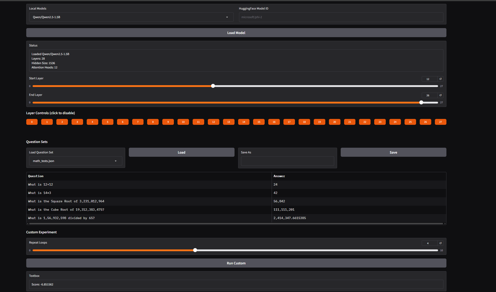
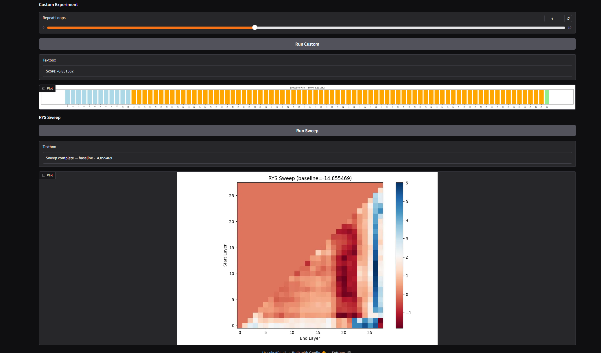

# RYS Neuroanatomy Dashboard





Based on [*LLM Neuroanatomy: How I Topped the LLM Leaderboard Without Changing a Single Weight*](https://dnhkng.github.io/posts/rys/) by David Noel Ng (2026)

This is still a work in progress. Feel free to suggest ideas, fixes, or corrections.
This was coded in a few hours using the writeup above, Claude for quick code writing, and I provided some functionality ideas.
Things may be broken, or may not be accurate, but those should get fixed.

---

## What is this?

This dashboard lets you treat a transformer model the way a neuroscientist treats a brain — scan it, identify functional regions, cut it apart, stitch it back together differently, and observe what happens.

The core discovery behind RYS: large language models develop a **functional anatomy** during training. Early layers translate input tokens into an abstract representation. Late layers translate back to tokens. The middle layers perform reasoning — organised into discrete **circuits**, multi-layer pipelines that perform complete cognitive operations. Duplicating an entire reasoning circuit (without changing any weights) can measurably improve performance.

This tool makes that workflow accessible through a Gradio UI, and extends it with physical layer surgery, targeted fine-tuning, and experimental training paradigms.

---

## Features

| Tab | What you can do |
|---|---|
| **RYS Analysis** | Load any HF model, run a full sweep of all `(start, end)` layer pairs, visualise the functional heatmap |
| **Layer Surgery** | Duplicate, delete, reorder, insert blank layers; zero attention heads or MLPs; export as a clean HF checkpoint |
| **Targeted Training** | Fine-tune only junction layers, a LoRA range, blank layers, or all parameters |
| **Advanced Training** | Ground-up training, layer-aware gradient routing, stretch→distill pipeline, RYS adaptive learning rates |

---

## Quick Start

Please install PyTorch for CPU or CUDA (GPU) based on your needs prior to installing requirements.

```bash
git clone https://github.com/Upgrade255/rys-dashboard.git
cd rys-dashboard
pip install -r requirements.txt
python app.py
```

Then open `http://localhost:7860` in your browser.

---

## Installation

### Core (required)

```bash
pip install -r requirements.txt
```

### Optional quantization backends

```bash
# 4-bit / 8-bit (bitsandbytes)
pip install bitsandbytes

# AWQ
pip install autoawq

# GPTQ
pip install auto-gptq

# GGUF (llama.cpp) — CPU
pip install llama-cpp-python

# GGUF — CUDA
CMAKE_ARGS="-DGGML_CUDA=on" pip install llama-cpp-python

# ExLlamaV2 — see https://github.com/turboderp/exllamav2
```

---

## File Structure

```
rys-dashboard/
├── app.py                  # Gradio UI — four tabs
├── rys_engine.py           # RYS sweep engine
├── layer_surgeon.py        # Physical layer manipulation + HF export
├── model_trainer.py        # Targeted fine-tuning
├── adaptive_trainer.py     # Advanced training systems
├── question_sets/          # Saved Q&A probe sets
│   └── example_probes.json
├── requirements.txt
├── DOCUMENTATION.md        # Full documentation
└── README.md
```

---

## The RYS Sweep

The sweep tests every valid `(start, end)` layer pair. For each pair, it duplicates the layer range at inference time (no weight changes) and measures the score change on your probe dataset:

```
path: [0 → 1 → ... → start → ... → end → start → ... → end → end+1 → ... → N-1]
```

The resulting heatmap is a **functional MRI of the transformer**:

- 🔴 **Red** — duplicating this range improves performance (reasoning circuit)
- 🔵 **Blue** — duplicating this range hurts performance (translation/decoding region)
- **Diagonal bands** in the middle = reasoning circuits
- **Blue wall** on the right = decoding layers (don't duplicate)

---

## Layer Surgery

All operations are **staged** — nothing is written to disk until you click Export. The export writes files directly (no live model mutation) to avoid HuggingFace metadata corruption issues:

1. Remaps state dict keys per the operation plan
2. Patches `config.json` via `to_dict()` — including per-layer list fields like `layer_types`
3. Writes `model.safetensors` (auto-sharded for large models)
4. Saves tokenizer and a `surgery_manifest.json` for reproducibility

Exported models are standard HF checkpoints loadable with `AutoModelForCausalLM.from_pretrained()`.

---

## Advanced Training

Three experimental paradigms:

**Layer-Aware Training** — classifies each training sample by cognitive type (math, code, reasoning, etc.) and routes gradients only to layers relevant to that type. A `SpecialisationProbe` runs periodically to detect emerging functional specialisation and update routing to reinforce it.

**Stretch → Distill** — inserts blank layers into a small model, trains the stretched model to develop specialised functional regions, then distils back to the original architecture using output KD + activation matching. The activation matching teaches the student *where* to put reasoning, not just *what* the answer is.

**RYS Adaptive LR** — maps RYS sweep delta scores to per-layer learning rate multipliers. Reasoning circuit layers get higher LR; stable translation layers get lower LR.

---

## Quantization Support

| Format | Surgery | Export | Notes |
|---|---|---|---|
| fp16 / fp32 | ✅ | ✅ | Full support |
| bitsandbytes 4-bit / 8-bit | ✅ | ✅ | |
| AWQ / GPTQ | ✅ | ✅ | |
| GGUF | ❌ | ❌ | Inference / RYS scan only |
| ExLlamaV2 | ❌ | ❌ | Inference / RYS scan only |

---

## My Personal Thoughts

I want to first use this to analyze how using RYS during initial training can affect final model outputs.

These are more ideas I don't have time for (currently):

- Forcing 'neuro-organs' to form in small models?
- Forming and extracting a complex neural calculator with defined operational layers? (finding the 'math layer group' and masking all but one layer per problem type to force structure?)
- Are the groups of layers reasonably separable or relevant if they are never allowed to form naturally in the first place?
- What kind of knowledge distillation is available with this analysis — could we use direct knowledge distillation to directly copy or continue training and fine-tuning on the portions of the models deemed 'good'?
- If the heatmaps show which layers are associated with that particular 'field of thinking', while also demonstrating where meaningful thinking happens, we could eventually learn to separate translation layers from poorly trained or generalised layers.

But those are just my initial thoughts.

---

## Credits & Attribution

The RYS (Repeat Yourself) technique, the neuroanatomy framing, and the original sweep concept and test design are the work of **David Noel Ng**:

> *LLM Neuroanatomy: How I Topped the LLM Leaderboard Without Changing a Single Weight* — https://dnhkng.github.io/posts/rys/
> Licensed under [CC BY 4.0](https://creativecommons.org/licenses/by/4.0/)

This dashboard is an independent implementation and extension built on top of those concepts. The RYS engine, layer surgery, training systems, and UI are original work released under the MIT License.

---

## License

MIT
